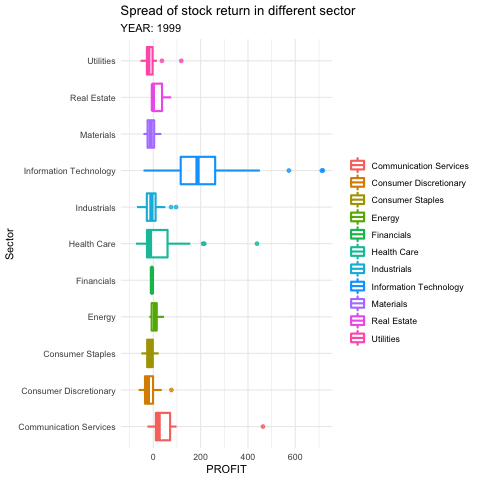

```{r setup, include=FALSE}
knitr::opts_chunk$set(echo = FALSE, message=FALSE, warning=FALSE)
```

```{r}
library(tidyverse)        # for data cleaning and plotting
library(tidymodels)       # for modeling ... tidily
library(lubridate)        # for date manipulation
library(openintro)        # for the abbr2state() function
library(gplots)           # for col2hex() function
library(RColorBrewer)     # for color palettes
library(ggthemes)         # for more themes (including theme_map())
library(plotly)           # for the ggplotly() - basic interactivity
library(gganimate)        # for adding animation layers to ggplots
library(transformr)       # for "tweening" (gganimate)
library(gifski)           # need the library for creating gifs but don't need to load each time
library(shiny)            # for creating interactive apps
library(janitor)  
library(stacks)            # for stacking models
library(glmnet)            # for regularized regression, including LASSO
library(ranger)            # for random forest model
library(kknn)              # for knn model
library(naniar)            # for examining missing values (NAs)
library(moderndive)        # for King County housing data
library(vip)               # for variable importance plots
library(rmarkdown)         # for paged tables
library(fastDummies)
library(usemodels)         # for suggesting step_XXX() functions
library(readr)
library(kableExtra)
library(DALEX)             # model Agnostic Language for exploration and explanation (for model interpretation)  
library(DALEXtra)
theme_set(theme_minimal())
```

## Introduction 

The financial market is a strange place that is very hard to navigate around. We have seen Warren Buffett, Ray Dalio, Charlie Munger - the very very best who have had billions of dollars. Others, 95% of the population, lose the money instead. 

So, how are the best of the best pick its stocks? It is from the fundamental, the technical side or the sentimental side? Within this paper, we hope to bring another perspective, using machine learning models to predict the profitability of the stock price. 

### Paper Outline 

First, we will list and explain the definition of each variable in our dataset. There are 25 variables in total as listed below. The variable we are going to predict is `PROFIT`. Then, we will start to process our data by merging with the macro data and removing some unwanted variables. After processing the data, we will have a data visualization section that shows the distribution and relationship between some variables. And to find the best model, we choose to explore three machine learning models which are LASSO, Random forest and Stacking models. We use a stacking method to create the stacking model by combining three models (Lasso, Random Forest, and KNN). Lastly, we will make a stock return prediction for 2021 using the trained model with the lowest R-squared and RMSE. 

### List of Variables 

For the dataset, we includes financial information on companies in the S&P 500 stock index from 1999-2021. This information was scraped from Yahoo Finance in November of 2021, and collected in a csv format for data analysis. The information includes metrics like sales, earnings, cogs, stock price, and market sector as well as macroeconomic data such as GDP or Money Supply. The goal is to analyze and model this data to better improve projections for a company’s future profitability. The variables in the data set are described below:

| Variable            | Meaning                                                                                                     |
|---------------------|-------------------------------------------------------------------------------------------------------------|
| YEAR                | The financial year of the company                                                                           |
| COMPANY             | The company’s stock abbreviation symbol                                                                     |
| MARKET.CAP          | The total market capitalization of the company (Volume * Price)                                             |
| EARNINGS            | The earnings in dollars for the previous year for the given company                                         |
| SALES               | How much the company sold in dollars last year                                                              |
| CASH                | How much cash the company has in dollars at the end of the previous year                                    |
| Name                | The full name of the company                                                                                |
| Sector              | The name of the sector that the company is a part of                                                        |
| PRICE               | The price of the stock when it is bought                                                                    | 
| Sell                | The price of the stock when it is sold                                                                      |
| VOLUME              | The total number of shares that the company has at that moment                                                           |
| COGS                | The total amount the company paid as a cost directly related to the sale of products                        | 
| INVESTMENT          | The total asset or item acquired with the goal of generating income or appreciation                         |
| RECIEVABLE          | The debts owed to a company by its customers for goods that have been delivered or used but not yet paid for| 
| INVENTORY           | How much raw materials used in production as well as the goods produced that are available for sale         | 
| DEBTS               | How much money the company borrow from other parties                                                        | 
| CPALTT01USM657N_PC1 | The percentage change in CPI (measure of inflation)                                                         | 
| GDP                 | The monetary value of all finished goods and services made within a country                                 |
| GDP_PC1             | The percentage change in GDP                                                                                |
| T10Y2Y              | Ten year treasury bonds minus two year treasury bonds                                                       |
| M1SL                | The total currency and other liquid instruments in a country's economy                                      |
| M1SL_PC1            | The percentage change in money supply                                                                       |
| PROFIT              | How much the money made or lost on an investment       

### Loading data

```{r}
finalDATASET <- read_csv("FINALDATASET.csv")
macro_data <- read_csv("clean_macro - Sheet1.csv")
```

```{r}
final_data <- finalDATASET %>% 
  # make Sector dummy variables
  dummy_cols(select_columns = "Sector") %>% 
  # merge with updated macro data
  select(-CPALTT01USM657N_PC1,
         -GDP,
         -GDP_PC1,
         -M1SL_PC1 ,
         -M1SL,
         -PRICE,
         -Sell,
         -COMPANY) %>% 
  merge(macro_data) %>% 
  # convert Macro factors from characters to numeric
  mutate(across(c("CPALTT01USM657N_PC1","GDP","GDP_PC1","T10Y2Y","M1SL_PC1","M1SL"),
                as.numeric)) %>% 
  group_by(YEAR,Sector) %>% 
  # replacing the missing value with median od the industry in that year
  mutate(across(c(DEBTS,INVESTMENTS,CASH,VOLUME,EARNINGS,COGS,SALES,RECEIVABLE,INVENTORY),~replace(.,.==0,median(.)))) %>%
  # delete less important factors -> Exchange can possibily be deleted
  ungroup() %>%  
  mutate(across(c(!where(is.numeric),-"Name"),as.factor)) %>% 
  select(-Earnings_next_year,-observation_date) %>% 
  drop_na() 

# filter out the data for 2021
final_data_2021 <- final_data %>% 
  filter(YEAR == 2021)

final_data <- final_data %>% 
  filter(YEAR < 2021)

# split the data
set.seed(327) #for reproducibility

data_split <- initial_split(final_data, 
                             prop = .75)
data_training <- training(data_split)
data_testing <- testing(data_split)

# quick look of the data 
final_data %>% 
  head(5)
```

## Data Visualization
We first explored distributions of our predictors and outcome. As the following graph suggested, all the numeric variables are severely right-skewed with some outliers. In our data, though the numbers of firms in each sector are unbalanced, we got a decent amount of data for each sector.  
```{r}

  final_data %>% 
  select(where(is.numeric)) %>% 
  select(-starts_with("Sector_")) %>% 
  pivot_longer(cols = everything(),
               names_to = "variable", 
               values_to = "value") %>% 
  ggplot(aes(x = value)) +
  geom_histogram(bins = 30) +
  facet_wrap(vars(variable), 
             scales = "free",
             nrow = 4,
             ncol=5)

```
```{r}
final_data %>% 
  select(where(is.factor)) %>% 
  pivot_longer(cols = everything(),
               names_to = "variable", 
               values_to = "value") %>% 
  ggplot(aes(x = value)) +
  geom_bar() +
  facet_wrap(vars(variable), 
             scales = "free", 
             nrow = 4) + 
  theme(axis.text.x = element_text(angle = 45))

```

  
Then, we continued to explore the relationship between regressors and the outcome. By observation, we can't see a strong correlation between fundemental factors, such as investments and debts, and stock return. It may indicate that linear model is not an ideal model in this case. 

```{r}
final_data %>% 
  ggplot(aes(x = INVESTMENTS, y = PROFIT,color = YEAR)) + 
  geom_point(alpha = 0.5)+
  geom_smooth(se = FALSE) + 
  labs(title = "Relationship between investments and stock return")
```

```{r}
final_data %>% 
  ggplot(aes(x = DEBTS, y = PROFIT,color = YEAR)) + 
  geom_point(alpha = 0.5)+
  geom_smooth(se = FALSE) + 
  labs(title = "Relationship between debts and stock return")
```

With this anamiation, we could see that the returns of stocks follow a cycle, which may be influenced by macroeconomic condition. The return in 1999 and 2019 seems to be the highest for all industries. Also, we noticed that some industries vary a lot year to year, such as IT and healthcare industry. 

```{r eval = FALSE}
sector_return_an<-final_data %>%
  ggplot(aes(x = PROFIT, y = Sector)) +
  geom_boxplot(aes(color = Sector),
             alpha = .8,
             size = 1) + 
  labs(title = "Spread of stock return in different sector",
       subtitle = "YEAR: {closest_state}",
       color = "") + 
  transition_states(YEAR)
  
animate(sector_return_an, duration = 25)
anim_save("sector_return.gif")
```

```{r}

```

We further explored the relationship between the industry and the potential macroeconomic influencer using graphs below. Though the relationship doesn't seem to be linear, we do see how macroeconomic condition affect each industry differently and will account for that in our model.

```{r}
final_data %>% 
  group_by(YEAR,Sector) %>% 
  mutate(profit_por = PROFIT*`MARKET CAP`/(sum(`MARKET CAP`,na.rm = TRUE))) %>% 
  summarise(Sector_profit = sum(profit_por),
            GDP_PC1 = mean(GDP_PC1),
            CPALTT01USM657N_PC1 = mean(CPALTT01USM657N_PC1),
            Sector = Sector[1]) %>% 
  ggplot(aes(x = CPALTT01USM657N_PC1,y = Sector_profit,color = Sector))+
  geom_smooth(se = FALSE) + 
  labs(title = "Relationship between inflation and average return of a industry",
       x = "Percent Change in CPI",
       y = "Average Return of a sector")
  
```

```{r}
final_data %>% 
  group_by(YEAR,Sector) %>% 
  mutate(profit_por = PROFIT*`MARKET CAP`/(sum(`MARKET CAP`,na.rm = TRUE))) %>% 
  summarise(Sector_profit = sum(profit_por),
            GDP_PC1 = mean(GDP_PC1),
            CPALTT01USM657N_PC1 = mean(CPALTT01USM657N_PC1),
            Sector = Sector[1]) %>% 
  ggplot(aes(x = GDP_PC1,y = Sector_profit,color = Sector))+
  geom_smooth(se = FALSE) + 
  labs(title = "Relationship between GDP  and average return of a industry",
       x = "Percent Change in GDP",
       y = "Average Return of a sector")
```


## Stock Return Prediction Using Lasso 
### A Brief Overview on LASSO 
   
LASSO(Least Absolute Shrinkage & Selection Operator) is a algorithm that penalizes less informative predictors on the basis of Least Square Regression. For OLS, our goal is to minimize the residual sum of squares^[$RSS_{OLS} = \sum_{i=1}^{n}(y_{i}-\hat{y_{i}})$] whearas LASSO models try to minimize the RSS penalized by the number of coefficients^[Penalized RSS = $\sum_{i=1}^{n}(y_{i}-\hat{y_{i}}) + \lambda \sum_{j=1}^{p}|\hat{\beta_{j}}|$, where $\lambda$ is the penalty paramter and $\sum_{j=1}^{p}|\hat{\beta_{j}}|$ is the sum of non-intercept coefficients]. LASSO model will shrink the variables that are less important to zero. 

### Results from Lasso
  
We used a Lasso model to predic the return.To account for the fact the macroeconomic condition affects each industry differently, we also included the interaction term between GDP and sector dummies. The table below shows the estimate of each predictor in the Lasso Model.We can see that indicators in macroeconomics are relatively important to predict the stock return. The change in inflation and GDP all remain significant after shrinking. The interaction terms between GDP and industries also showed importance, accounting for the fact that the macroeconomic condition affects each industry differently: GDP seems to affect the stock return in Communication Services, Energy, and Consumer Discretionary sectors less given there negative coefficient estimates. However, the Lasso model does not perform well. It only explains 20% of the varaince in stock return and it also has a prediction is typically off by 46. 
```{r}
return_recipe <- recipe(PROFIT ~ ., #short-cut, . = all other vars
                       data = data_training) %>% 
  # filter to only have data after 2020
  step_filter(YEAR<2021) %>% 
  step_rm(Name,Sector,YEAR) %>% 
  #step_rm(GDP,M1SL,Name,Sector,YEAR) %>% 
  # add PE 
  step_mutate(PE = `MARKET CAP`/EARNINGS) %>%
  # Normalize all variables except for GDP
  step_normalize(all_predictors(), 
                 -all_nominal(),
                 -starts_with("Sector_")) %>% 
  # Create interaction terms
  step_interact(terms = ~c(GDP_PC1):starts_with("Sector_")) 
return_linear_mod <- 
  # Define a lasso model 
  # I believe default is mixture = 1 so probably don't need 
  linear_reg(mixture = 1) %>% 
  # Set the engine to "glmnet" 
  set_engine("glmnet") %>% 
  # The parameters we will tune.
  set_args(penalty = tune()) %>% 
  # Use "regression"
  set_mode("regression")

set.seed(456)
return_lm_wf <- 
  # Set up the workflow
  workflow() %>% 
  # Add the recipe
  add_recipe(return_recipe) %>% 
  # Add the modeling
  add_model(return_linear_mod)

penalty_grid <- grid_regular(penalty(),
                             levels = 10)

return_cv <- vfold_cv(data_training, v = 5)

return_lm_tune <- 
  return_lm_wf %>% 
  tune_grid(
    resamples = return_cv,
    grid = penalty_grid
    )

best_param<-return_lm_tune %>% 
  select_best(metric = "rmse")

return_lasso_final_wf <- return_lm_wf %>% 
  finalize_workflow(best_param)

return_lasso_final_mod <- return_lasso_final_wf %>% 
  fit(data = data_training)
return_lasso_final_mod %>% 
  pull_workflow_fit() %>% 
  tidy() %>% 
  arrange(desc(estimate)) %>% 
  kbl(caption = "Coefficient Estimates (LASSO)") %>% 
  kable_styling(bootstrap_options = c("striped", "bordered", "hover", "condensed")) %>% 
  scroll_box(width = "100%", height = "500px")
```
  
The graph below shows the most essential predictors for our model. We can see that macroeconomics indicators all ranked the top. 
```{r}
return_lasso_final_mod %>% 
  pull_workflow_fit() %>% 
  vip()
```
  
Here is the performance of the model on the testing data, the data we did not use to train our model. If the points and the blue line are perfectly aligned with the red line, it means a perfect prediction. We can see that our LASSO model does not perform well and tends to underestimate the stock with high returns, which are mostly from 2020 or earlier years.  

```{r}
test_prediction <- predict(
  return_lasso_final_mod,
  new_data = data_testing)

testing_lasso_pred<-data_testing %>% 
  mutate(.pred = test_prediction$.pred)
  
  
testing_lasso_pred %>% 
  ggplot(aes(x = PROFIT, 
             y = .pred,
             color = YEAR)) +
  geom_point(alpha = .5, 
             size = .5) +
  geom_smooth(se = FALSE) +
  geom_abline(slope = 1, 
              intercept = 0, 
              color = "darkred") +
  geom_text(aes(label = Name),label.size = 0.15,data = testing_lasso_pred %>% filter(PROFIT>300) )+
  labs(x = "Actual Return", 
       y = "Predicted Return") + 
  scale_color_viridis_b()
```

## Stock Return Prediction Using Random Forest  
### A Brief Overview on Random Forest

A random forest is a supervised machine learning algorithm that is constructed from decision tree algorithms. It can be used to solve both regression and classification problems. It utilizes ensemble learning, which is a technique that combines many classifiers to provide solutions to complex problems. This algorithm consists of many decision trees and establishes the outcome based on the predictions of those trees. It takes the average of the output from various trees and make prediction. 

We are going to train the random forest model by using `ranger` function with 200 trees and 6 variables randomly chosen at each split to predict our stock return.  

```{r}
# set up recipe 
ranger_recipe <-
  recipe(PROFIT ~ ., 
                       data = data_training) %>%
  step_filter(YEAR<2021) %>% 
  # remove the unwanted variables
  step_rm(YEAR,Name,GDP,M1SL,Sector) %>% 
  # add PE 
  step_mutate(PE = `MARKET CAP`/EARNINGS)

#define model
ranger_spec <- 
  rand_forest(mtry = 6, 
              min_n = 10, 
              trees = 200) %>% 
  set_mode("regression") %>% 
  set_engine("ranger")

#create workflow
ranger_workflow <- 
  workflow() %>% 
  add_recipe(ranger_recipe) %>% 
  add_model(ranger_spec)

#fit the model
set.seed(712) # for reproducibility - random sampling in random forest choosing number of variables
ranger_fit <- ranger_workflow %>% 
  fit(data_training)
```

### Results from Random Forest

Below are the OOB prediction error (MSE), OOB root mean square error (RMSe), and R squared score from the random forest model we have trained above. 

OOB error (MSE) represents the difference between the original and predicted values which are extracted by squaring the average difference over predictions from the trees that do not contain in their respective bootstrap sample. 

```{r}
ranger_fit$fit$fit$fit$prediction.error
```

OOB RMSE is the root mean square of the OOB prediction error above. The RMSE value is fairly high but  seems to be significantly better than the LASSO model. We can see that the Random Forest model performs better than the Lasso model. 

```{r}
sqrt(ranger_fit$fit$fit$fit$prediction.error)
```

R-Squared score is a statistical measure of fit that indicates how much variation of a dependent variable is explained by the independent variables in a regression model. For our model, the R-Squared score is around 0.4 meaning that 40% of our stock return is explained by our independent variables.

```{r}
ranger_fit$fit$fit$fit$r.squared
```

### Model Evaluation
#### Traning Data 

We use K-fold cross validation technique to evaluate our model. Below are the root mean squared error (rmse) averaged over all the five folds on the training dataset. 

```{r}
set.seed(1211) # for reproducibility
data_cv <- vfold_cv(data_training, v = 5)

metric <- metric_set(rmse)
ctrl_res <- control_stack_resamples()

ranger_cv <- ranger_workflow %>% 
  fit_resamples(data_cv, 
                metrics = metric,
                control = ctrl_res)

# Evaluation metrics averaged over all folds:
as.data.frame(collect_metrics(ranger_cv))
```

This is the graph showing the actual return vs. predicted return.  

```{r}
ranger_prediction <- predict(
  ranger_fit,
  new_data = data_training)

ranger_training_pred<-data_training %>% 
  mutate(.pred = ranger_prediction$.pred)
  
  
ranger_training_pred %>%
  ggplot(aes(x = PROFIT,
             y = .pred)) +
  geom_point(alpha = .5,
             size = .5) +
  geom_smooth(se = FALSE) +
  geom_abline(slope = 1,
              intercept = 0,
              color = "darkred") +
  labs(x = "Actual Return",
       y = "Predicted Return")

```

#### Testing Data

The table below shows the rmse on testing data. It is a bit higher but fairly similar to the error on training data so we could say that our model did not overfit. 

```{r}
set.seed(1211) # for reproducibility
data_cv <- vfold_cv(data_testing, v = 5)

metric <- metric_set(rmse)
ctrl_res <- control_stack_resamples()

ranger_cv <- ranger_workflow %>% 
  fit_resamples(data_cv, 
                metrics = metric,
                control = ctrl_res)

# Evaluation metrics averaged over all folds:
as.data.frame(collect_metrics(ranger_cv))
```

Below is the graph showing the actual return vs. predicted return on testing data.  

```{r}
ranger_test_prediction <- predict(
  ranger_fit,
  new_data = data_testing)

ranger_test_pred<-data_testing %>% 
  mutate(.pred = ranger_test_prediction$.pred)
  
  
ranger_test_pred %>%
  ggplot(aes(x = PROFIT,
             y = .pred)) +
  geom_point(alpha = .5,
             size = .5) +
  geom_smooth(se = FALSE) +
  geom_abline(slope = 1,
              intercept = 0,
              color = "darkred") +
  labs(x = "Actual Return",
       y = "Predicted Return")

```

### Interpretable Machine Learning 

```{r results='hide'}
rf_explain <- 
  explain_tidymodels(
    model = ranger_fit,
    data = data_training %>% select(-PROFIT), 
    y = data_training %>%  pull(PROFIT),
    label = "rf"
  )
rf_mod_perf <-  model_performance(rf_explain)

```

```{r}
hist_plot <- 
  plot(rf_mod_perf, 
       geom = "histogram")
box_plot <-
  plot(rf_mod_perf, 
       geom = "boxplot")

hist_plot
box_plot
```

Based on the box-plot and the histogram below, the residuals mostly lie between -50 to 50, but there are also some outliners that can go up to 400. 

```{r}
set.seed(10) #since we are sampling & permuting, we set a seed so we can replicate the results
rf_var_imp <- 
  model_parts(
    rf_explain
    )
plot(rf_var_imp, show_boxplots = TRUE)
```

According to the feature importance bar chart below, we can see that the top three important features are market cap, earnings, M1SL_PC1, and GDP_PC1. 

## Stacking Model

### A Brief Overview on Stacking Model

What is stacking? Model stacking is an ensembling method that takes the outputs of many models and combines them to generate a new model—referred to as an ensemble in this package—that generates predictions informed by each of its members.

### Process of Stacking Model

Stacking model involves three separate steps: 

1. Set up the ensemble: 

- Specify a list of base learners (with a specific set of model parameters).

- Specify a meta learning algorithm.

2. Train the ensemble

- Train each of the base learners on the training set.
- Perform k-fold CV on each of the base learners and collect the cross-validated predictions from each (the same k-folds must be used for each base learner). These predicted values represent base learning models and the meta learning model, which can then be used to generate predictions on new data.

3. Predict on new data.

- To generate ensemble predictions, first generate predictions from the base learners.

- Feed those predictions into the meta learner to generate the ensemble prediction.

```{r}
ranger_recipe <- 
  recipe(formula = PROFIT ~ ., 
         data = data_training) %>% 
  # Make these evaluative variables, not included in modeling
  update_role(all_of(c("YEAR", "Name", "Sector")),
              new_role = "evaluative")

ranger_spec <- 
  rand_forest(mtry = 6, 
              min_n = 10, 
              trees = 200) %>% 
  set_mode("regression") %>% 
  set_engine("ranger")

ranger_workflow <- 
  workflow() %>% 
  add_recipe(ranger_recipe) %>% 
  add_model(ranger_spec) 

ranger_fit <- ranger_workflow %>% 
  fit(data_training)

set.seed(1211) # for reproducibility
final_data_cv <- vfold_cv(data_training, v = 5)

metric <- metric_set(rmse)
ctrl_res <- control_stack_resamples()

ranger_cv <- ranger_workflow %>% 
  fit_resamples(final_data_cv, 
                metrics = metric,
                control = ctrl_res)
```


```{r}
# lasso recipe and transformation steps
lasso_final_data_recipe <- recipe(PROFIT ~ ., 
                       data = data_training) %>% 
  #step_rm(Name, Sector, YEAR, COMPANY) %>%
  update_role(all_of(c("Name",
                       "Sector",
                       "YEAR")),
              new_role = "evaluative") %>% 
  step_dummy(all_nominal(), 
             -all_outcomes(), 
             -has_role(match = "evaluative")) %>% 
  step_normalize(all_predictors(), 
                 -all_nominal())

#define lasso model
lasso_mod <- 
  linear_reg(mixture = 1) %>% 
  set_engine("glmnet") %>% 
  set_args(penalty = tune()) %>% 
  set_mode("regression")

# create workflow
lasso_wf <- 
  workflow() %>% 
  add_recipe(lasso_final_data_recipe) %>% 
  add_model(lasso_mod)

# penalty grid - changed to 10 levels
penalty_grid <- grid_regular(penalty(),
                             levels = 10)

# add ctrl_grid - assures predictions and workflows are saved
ctrl_grid <- control_stack_grid()

# tune the model using the same cv samples as random forest

lasso_tune <- 
  lasso_wf %>% 
  tune_grid(
    resamples = final_data_cv,
    grid = penalty_grid,
    metrics = metric,
    control = ctrl_grid
    )
```

```{r}
# create a model definition
knn_mod <-
  nearest_neighbor(
    neighbors = tune("k")
  ) %>%
  set_engine("kknn") %>% 
  set_mode("regression")

# create the workflow
knn_wf <- 
  workflow() %>% 
  add_model(knn_mod) %>%
  add_recipe(lasso_final_data_recipe)

# tune it using 4 tuning parameters
knn_tune <- 
  knn_wf %>% 
  tune_grid(
    final_data_cv,
    metrics = metric,
    grid = 4,
    control = ctrl_grid
  )
```

```{r}
final_data_stack <- 
  stacks() %>% 
  add_candidates(ranger_cv) %>% 
  add_candidates(lasso_tune) %>% 
  add_candidates(knn_tune)
```

```{r}
final_data_blend <- 
  final_data_stack %>% 
  blend_predictions()
```

```{r}
final_data_blend
```


```{r}
final_data_blend$metrics %>% 
  filter(.metric == "rmse") %>% 
  summarise(mean_rmse = mean(mean))
```
Here, we can see that the RMSE is 39.8, which shows that a predicted profit could have the mean difference with the actual profit of 39.7. 

```{r}
autoplot(final_data_blend)
```

```{r}
final_data_final_stack <- final_data_blend %>% 
  fit_members()
```

### Testing Result from Stacking Model

```{r}
final_data_final_stack %>% 
  predict(new_data = data_testing) %>% 
  bind_cols(data_testing) %>% 
  select(Name, .pred, PROFIT) %>% 
  arrange(desc(.pred)) %>% 
  head(10)
```

Here, we can see that when the model predicts company with high rate of return, the model performs really well. Based on the table, every company within the highest prediction yields positive and extremely high rate of return. 

After finishing our model, we then move on to compare the three models: 

### Comparison of the Three Models

With the three models, we then move on to see which model performs the best: 

#### Lasso model

```{r}
data_frame(return_lm_tune %>%
  select(id, .metrics) %>%
  unnest(.metrics) %>%
  filter(.metric == "rsq") %>% 
  filter(.config == "Preprocessor1_Model08") %>% 
  summarise(mean_rsq = mean(.estimate)),

return_lm_tune %>%
  select(id, .metrics) %>%
  unnest(.metrics) %>%
  filter(.metric == "rmse") %>% 
  filter(.config == "Preprocessor1_Model08") %>% 
  summarise(mean_rmse = mean(.estimate)))
```

#### Random Forest Model

```{r}
#OOB RMSE
data.frame(mean_rmse = sqrt(ranger_fit$fit$fit$fit$prediction.error),
# R squared
mean_rsq = ranger_fit$fit$fit$fit$r.squared)
```


#### Stacking Model 

```{r}
# Stacking model: 
data.frame(final_data_blend$metrics %>% 
  filter(.metric == "rmse") %>% 
  summarise(mean_rmse = mean(mean)),

final_data_blend$metrics %>% 
  filter(.metric == "rsq") %>% 
  summarise(mean_rsq = mean(mean)))
```

Here, we can see that compared to the three models, even though Random Forest performs better than the stacking model, stacking model use features in the Random Forest along with additional features from KNN and lasso. With that reason, we will choose stacking model as our model choice. 

## Stock Return Prediction for 2021

After picking our model, we then move on to use the model to predict the potential profit for 2021: 

```{r}
set.seed(456)
ytd = c(80.30, 39.77, -8.26, 11.29, 22.08, 132.51, 137.04, -4.22, 39.77, 20.76, 26.41, 26.34, 41.50, 178.43, 18.70, 87.29, -6.16, 52.58, 8.70, -13.70)
set.seed(456)
pred_2021<-final_data_final_stack %>% 
  predict(new_data = final_data_2021) %>% 
  bind_cols(final_data_2021) %>% 
  select(Name, .pred) %>% 
  arrange(desc(.pred)) %>% 
  head(20) %>% 
  mutate(actual_ytd = ytd) 
pred_2021 %>% 
  kbl() %>% 
  kable_styling(bootstrap_options = c("striped", "bordered", "hover", "condensed")) %>% 
  column_spec(c(1,3), color = ifelse(pred_2021$actual_ytd < 0, "red", "darkgreen")) %>% 
  scroll_box(width = "100%", height = "500px") 
```

As we can see from the stock return prediction, our final model performs really well. For the top 20 companies, only four generates loss year-to-date. Moreover, if we invest the same amount of money for the top 20 companies, we will have a 47.35% rate of return year-to-date. This is much higher than the YTD return for the S&P 500 of 29.19%.

## Conclusion 

The weakness of our model is that the average error of prediction is still very high so if one wants to predict the exact return, our model won't be ideal. But the strength of our model is that for stocks with extremely high returns, even though the prediction might not be that precise, highly likely, our model will predict positive returns. That means, in real life, if we choose the top stocks to invest in based on our prediction, it is less likely we are going to lose money. Another strength of using a model to help with investment is that it excludes our subjective feelings. 

To make the model better, we could do more research and add more regressors. For example, some financial indicators that are important for value investing are not reflected in our model due to the lack of data.  Examples of those variables include Price to Sales, Price to Cash Flow, and Price to Book. Also, since we are concerned about the long-term return and all fundamental factors usually take longer to affect the firms, it's probably helpful to do return in 2 years or 3 years or include lag of some variables in our model. 